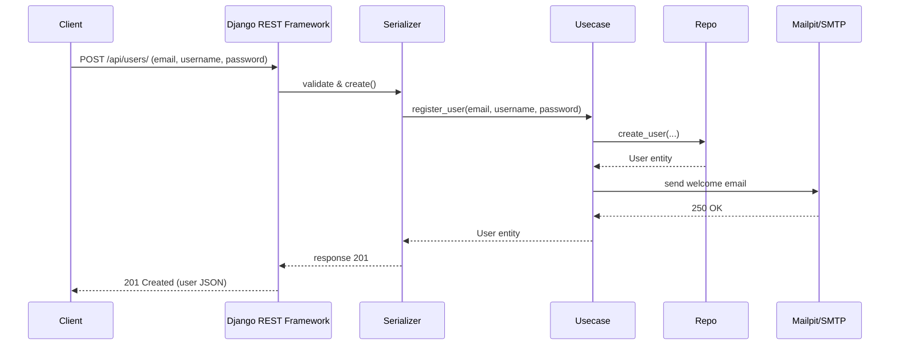
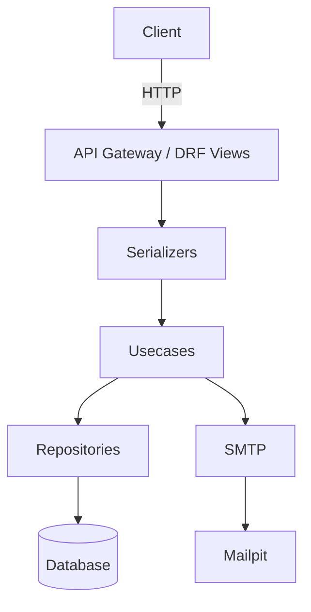
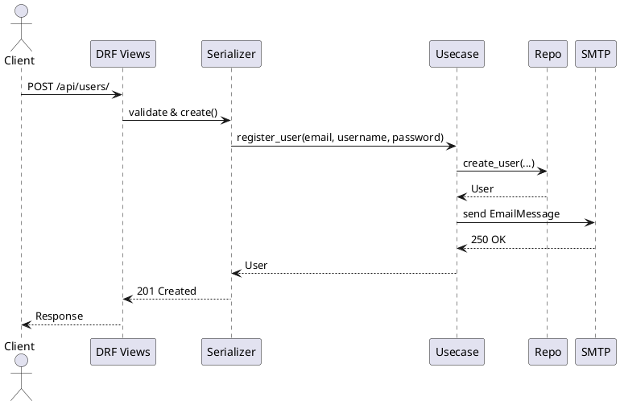
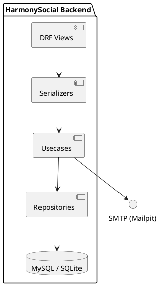

# HarmonySocial — Backend Django (documentación)

Este repositorio contiene un backend Django minimal para HarmonySocial creado desde cero. El objetivo realizado incluye:

- CRUD de usuarios con un modelo de usuario personalizado (`email` como campo de autenticación).
- Registro y login con JWT (djangorestframework-simplejwt).
- Envío de correo de bienvenida por SMTP al registrar un usuario (diseñado para Mailpit en pruebas).
- Separación de responsabilidades siguiendo una arquitectura limpia: entidades (modelos), repositorios, usecases (casos de uso) y adaptadores web (serializers/views).

## Resumen de lo implementado

- Proyecto Django con app `users`.
- `users.models.User`: User personalizado (EMAIL como `USERNAME_FIELD`).
- `users/repositories.py`: abstracción de persistencia.
- `users/usecases.py`: lógica de negocio; `register_user` crea usuario y envía correo.
- `users/serializers.py`: DTO y adaptación; el serializer de creación delega al usecase para mantener la separación.
- `users/views.py`: `UserViewSet` (CRUD) y `login_view` (genera tokens JWT).
- Envío de email: usa `django.core.mail.EmailMessage` con `get_connection()` para respetar la configuración SMTP en `backend_hs/settings.py`.

## Estado de requisitos

- CRUD usuarios: Done
- Registro + login con JWT: Done
- Envío de correo SMTP (Mailpit para pruebas): Implementado (envío sincrónico en usecase). Test agregado con backend en memoria: Done
- Arquitectura limpia y comentarios en código: Done

## Archivos importantes y propósito

- `backend_hs/settings.py` — configuración del proyecto (DB, `EMAIL_*` defaults para Mailpit, JWT config).
- `users/models.py` — modelo `User` y `UserManager`.
- `users/repositories.py` — funciones para CRUD de persistencia.
- `users/usecases.py` — `register_user`, `authenticate_user` y el envío de correo.
- `users/serializers.py` — `UserCreateSerializer` delegando a `usecases.register_user`.
- `users/views.py` — `UserViewSet` y `login_view` (JWT tokens).
- `users/tests.py` — tests de login/registro y test que verifica envío de correo usando `locmem` backend.

## Cómo ejecutar (entorno Windows PowerShell)

1) Crear y activar virtualenv:

```powershell
python -m venv env; .\env\Scripts\Activate.ps1
```

2) Instalar dependencias:

```powershell
pip install -r requirements.txt
```

3) Configurar la base de datos en `backend_hs/settings.py` (por defecto intenta MySQL `harmonysocial`).

4) Migraciones y superuser (si usas una base limpia):

```powershell
python manage.py makemigrations
python manage.py migrate
python manage.py createsuperuser
```

5) Ejecutar servidor:

```powershell
python manage.py runserver
```

## Probar endpoints

- Registro público: POST `/api/users/`  (body JSON: `email`, `username`, `password`)
- Login: POST `/api/auth/login/` (devuelve access + refresh tokens)

Ejemplo rápido con curl (PowerShell):

```powershell
curl -X POST http://127.0.0.1:8000/api/users/ -H "Content-Type: application/json" -d '{"email":"user@example.com","username":"user1","password":"pass12345"}'
```

## Envío de correo (Mailpit)

Para pruebas locales recomiendo Mailpit. Por defecto el proyecto usa:

- SMTP: `localhost:1025` (configurable vía variables de entorno `EMAIL_HOST`, `EMAIL_PORT`).
- Interfaz Mailpit: `http://localhost:8025`.

Pasos:

1. Inicia Mailpit (binario o Docker).
2. Ejecuta el servidor Django.
3. Registra un usuario; el usecase intentará enviar un email usando la configuración SMTP.
4. Abre la UI de Mailpit y verás el correo de bienvenida.

Nota: en los tests el backend de correo se sobreescribe a `locmem` para comprobar el envío sin depender de Mailpit.

## Tests

Ejecuta:

```powershell
python manage.py test users
```

Se incluyen tests que verifican login, registro y que el registro envía un correo (backend en memoria).

## Flujo y conexión entre capas

1. Petición HTTP POST `/api/users/` -> `UserViewSet.create`
2. `UserCreateSerializer.create` delega a `usecases.register_user`
3. `usecases.register_user` valida, llama a `repositories.create_user` para persistir y luego envía un email con `EmailMessage` usando la conexión SMTP configurada.
4. Repositorio usa `users.models.User.objects.create_user` internamente para persistir.

### Contrato mínimo (register_user)

- Inputs: `email`, `username`, `password`
- Outputs: entidad `User` creado
- Error modes: `ValidationError` si email ya registrado; errores de envío de correo se registran y no bloquean el registro.

## Diagramas (Mermaid)

### Secuencia: registro de usuario



### Componentes (alto nivel)



## Diagramas (PlantUML)

> Nota: para renderizar PlantUML puedes usar la extensión PlantUML en VSCode o un servidor PlantUML.

### Secuencia (PlantUML)



### Component diagram (PlantUML)



## Notas finales y recomendaciones

- Actualmente el envío de correo se hace de forma síncrona dentro del usecase. Para producción recomiendo enviar correos de forma asíncrona (Celery/RQ o similar) y añadir retries/observabilidad.
- Si necesitas que prepare la versión asíncrona o un script para poblar datos y comprobar Mailpit automáticamente, lo puedo crear.
- Revisa `backend_hs/settings.py` para ajustar `EMAIL_*` y las credenciales en entornos reales.

---

Si quieres que incluya un diagrama adicional o un README reducido para despliegue, lo añado enseguida.
