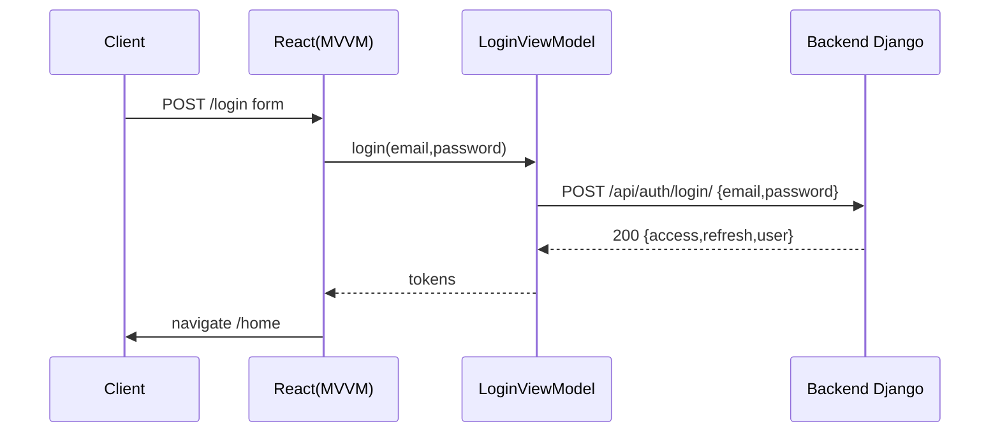
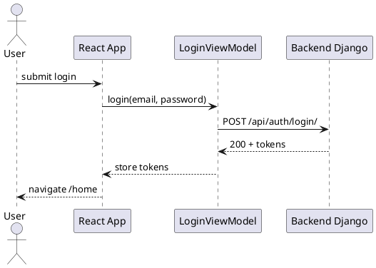

# HarmonySocial — Frontend (React, MVVM)

Este proyecto es el frontend mínimo para HarmonySocial. Está diseñado con una arquitectura MVVM ligera (Views = `src/components`, ViewModels = `src/viewmodels`) y soporte de i18n (en/es/fr). Está preparado para desplegar en Firebase Hosting.

Características implementadas

- Login y registro (formularios) conectados al backend Django.
- Manejo de tokens (almacenamiento simple en localStorage como `hs_access`/`hs_refresh`).
- Traducciones en `src/locales` (inglés, español, francés) usando `i18next`.
- Rutas usando `react-router-dom`: `/login`, `/register`, `/home`.
- Estilos básicos con Bootstrap (CDN).

Estructura principal

- `public/` — HTML público.
- `src/index.jsx` — entry point.
- `src/App.jsx` — enrutamiento y protección de rutas.
- `src/components/` — vistas (Login, Register, Home).
- `src/viewmodels/` — lógica de presentación y llamadas API (LoginViewModel, RegisterViewModel).
- `src/locales/` — archivos de traducción.
- `src/firebase.js` — placeholder para configuración de Firebase (si lo vas a usar).

Contrato mínimo (API)

El frontend espera que el backend exponga las siguientes rutas REST JSON:

- POST /api/auth/login/  — body: { email, password }  → response: { access, refresh, user }
- POST /api/users/       — body: { email, username, password } → response: 201 Created (user)

Config variables

- `REACT_APP_API_BASE_URL` — URL base del backend (por defecto `http://127.0.0.1:8000`).
- Variables opcionales para Firebase en `src/firebase.js` (`REACT_APP_FIREBASE_*`).

Instalación y ejecución (Windows PowerShell)

```powershell
cd \path\to\frontendHarmonySocialDjango
npm install
REACT_APP_API_BASE_URL=http://127.0.0.1:8000 npm start
```

Notas:
- Si el backend corre en otra máquina/puerto, ajusta `REACT_APP_API_BASE_URL`.
- En producción, guarda tokens de forma segura (cookies HttpOnly o similar).

MVVM y flujo

En esta app MVVM ligero:

- View (component) — renderiza UI y enlaza eventos.
- ViewModel — expone funciones (ej. `login`, `register`) que invocan la API y gestionan efectos secundarios (guardar tokens).

Flujo de login (simplificado):

1. El usuario envía formulario en `Login`.
2. `Login` llama a `LoginViewModel.login()`.
3. `LoginViewModel` hace POST a `/api/auth/login/` y guarda tokens en localStorage.
4. Al completarse, la vista navega a `/home`.

Diagrama de secuencia (Mermaid)



Diagrama de componentes (Mermaid)

```mermaid
graph LR
	A[Browser] --> B[React App]
	B --> C[Components (Views)]
	C --> D[ViewModels]
	D --> E[API (Backend)]
	B --> F[i18n locales]
	B --> G[Firebase (optional)]
```

Diagramas PlantUML



Pruebas

- Ejecuta `npm start` y prueba rutas `/login` y `/register`.
- En los tests manuales verifica que el backend responde con 200/201 y que los tokens se almacenan en `localStorage`.

Buenas prácticas y siguientes pasos

- Usar `react-router` (ya integrado) para rutas más complejas.
- Implementar refresh automático de tokens y expiración.
- Mover tokens a cookies seguras en producción.
- Integrar Firebase Hosting: puedo generar `firebase.json` y un script de deploy cuando quieras.

Contacto rápido

Si quieres que cree los scripts de build + `firebase.json` y despliegue automático, lo hago a continuación.

